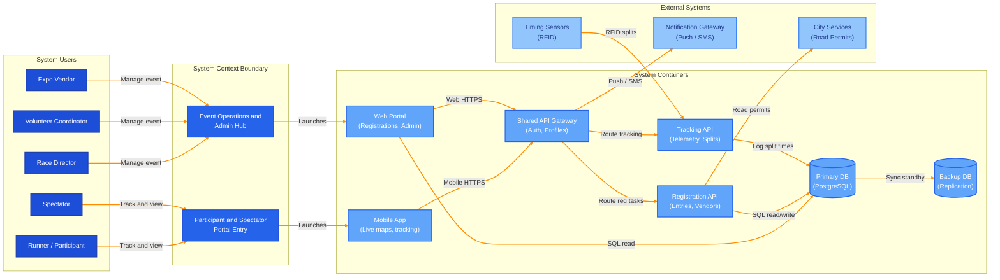
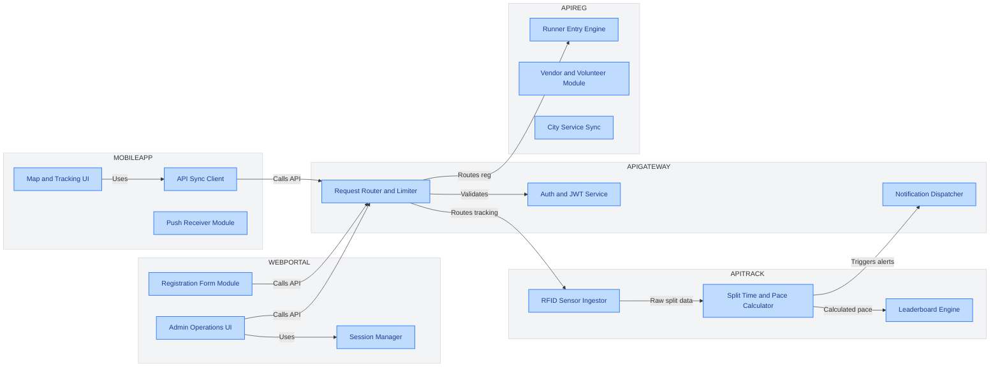
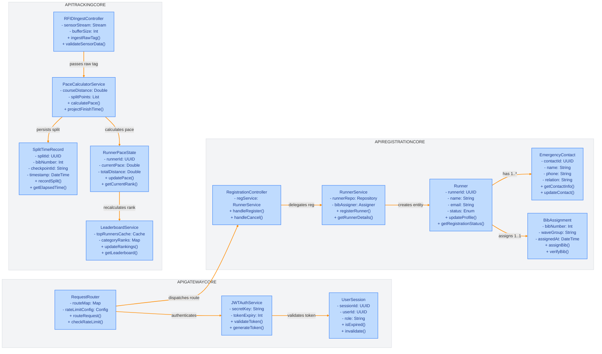

# Urban Marathon C4 Model

### L1 & L2 Containers Architecture

```mermaid
flowchart LR
    %% Styling Definitions
    classDef userStyle fill:#1D4ED8,stroke:#1E40AF,stroke-width:2px,color:#FFFFFF;
    classDef contextStyle fill:#2563EB,stroke:#1D4ED8,stroke-width:2px,color:#FFFFFF;
    classDef containerStyle fill:#60A5FA,stroke:#2563EB,stroke-width:2px,color:#FFFFFF;
    classDef extStyle fill:#93C5FD,stroke:#3B82F6,stroke-width:2px,color:#1E3A8A;

    subgraph USERS ["System Users"]
        U_Runner["Runner / Participant"]
        U_Spec["Spectator"]
        U_Dir["Race Director"]
        U_Vol["Volunteer Coordinator"]
        U_Ven["Expo Vendor"]
    end

    subgraph CONTEXT ["System Context Boundary"]
        CTX_Portal["Participant and Spectator<br/>Portal Entry"]
        CTX_Admin["Event Operations and<br/>Admin Hub"]
    end

    subgraph CONTAINERS ["System Containers"]
        C_App["Mobile App<br/>(Live maps, tracking)"]
        C_Web["Web Portal<br/>(Registrations, Admin)"]
        C_GW["Shared API Gateway<br/>(Auth, Profiles)"]
        C_RegAPI["Registration API<br/>(Entries, Vendors)"]
        C_TrackAPI["Tracking API<br/>(Telemetry, Splits)"]
        C_MainDB[("Primary DB<br/>(PostgreSQL)")]
        C_BackDB[("Backup DB<br/>(Replication)")]
    end

    subgraph EXTERNAL ["External Systems"]
        EXT_Sensors["Timing Sensors<br/>(RFID)"]
        EXT_City["City Services<br/>(Road Permits)"]
        EXT_Notif["Notification Gateway<br/>(Push / SMS)"]
    end

    %% Apply Component Styles
    class U_Runner,U_Spec,U_Dir,U_Vol,U_Ven userStyle;
    class CTX_Portal,CTX_Admin contextStyle;
    class C_App,C_Web,C_GW,C_RegAPI,C_TrackAPI,C_MainDB,C_BackDB containerStyle;
    class EXT_Sensors,EXT_City,EXT_Notif extStyle;

    %% Global Orange Link Styling
    linkStyle default stroke:#FF8C00,stroke-width:2px;

    %% User Interactions
    U_Runner -->|"Track and view"| CTX_Portal
    U_Spec -->|"Track and view"| CTX_Portal
    U_Dir -->|"Manage event"| CTX_Admin
    U_Vol -->|"Manage event"| CTX_Admin
    U_Ven -->|"Manage event"| CTX_Admin

    %% Boundary Ingress
    CTX_Portal -->|"Launches"| C_App
    CTX_Admin -->|"Launches"| C_Web

    %% Container Communications
    C_App -->|"Mobile HTTPS"| C_GW
    C_Web -->|"Web HTTPS"| C_GW
    C_Web -->|"SQL read"| C_MainDB

    C_GW -->|"Route reg tasks"| C_RegAPI
    C_GW -->|"Route tracking"| C_TrackAPI

    C_RegAPI -->|"SQL read/write"| C_MainDB
    C_TrackAPI -->|"Log split times"| C_MainDB
    C_MainDB -->|"Sync standby"| C_BackDB

    %% External System Integrations
    EXT_Sensors -->|"RFID splits"| C_TrackAPI
    C_RegAPI -->|"Road permits"| EXT_City
    C_GW -->|"Push / SMS"| EXT_Notif
```

---

### L3 Components Architecture

```mermaid
flowchart LR
    %% Styling Definitions
    classDef compStyle fill:#BFDBFE,stroke:#3B82F6,stroke-width:1.5px,color:#1E3A8A;

    subgraph APITRACK ["APITRACK"]
        TRK_Ingest["RFID Sensor Ingestor"]
        TRK_Splits["Split Time and Pace Calculator"]
        TRK_Board["Leaderboard Engine"]
    end

    subgraph MOBILEAPP ["MOBILEAPP"]
        MA_UI["Map and Tracking UI"]
        MA_Sync["API Sync Client"]
        MA_Push["Push Receiver Module"]
    end

    subgraph WEBPORTAL ["WEBPORTAL"]
        WP_Admin["Admin Operations UI"]
        WP_Reg["Registration Form Module"]
        WP_Auth["Session Manager"]
    end

    subgraph APIGATEWAY ["APIGATEWAY"]
        GW_Notif["Notification Dispatcher"]
        GW_Router["Request Router and Limiter"]
        GW_Auth["Auth and JWT Service"]
    end

    subgraph APIREG ["APIREG"]
        REG_Core["Runner Entry Engine"]
        REG_Vendor["Vendor and Volunteer Module"]
        REG_Permit["City Service Sync"]
    end

    %% Apply Component Styles
    class TRK_Ingest,TRK_Splits,TRK_Board compStyle;
    class MA_UI,MA_Sync,MA_Push compStyle;
    class WP_Admin,WP_Reg,WP_Auth compStyle;
    class GW_Notif,GW_Router,GW_Auth compStyle;
    class REG_Core,REG_Vendor,REG_Permit compStyle;

    %% Subgraph Background Styling
    style APITRACK fill:#F3F4F6,stroke:#D1D5DB,stroke-width:1px;
    style MOBILEAPP fill:#F3F4F6,stroke:#D1D5DB,stroke-width:1px;
    style WEBPORTAL fill:#F3F4F6,stroke:#D1D5DB,stroke-width:1px;
    style APIGATEWAY fill:#F3F4F6,stroke:#D1D5DB,stroke-width:1px;
    style APIREG fill:#F3F4F6,stroke:#D1D5DB,stroke-width:1px;

    %% Internal Module Connections
    MA_UI -->|"Uses"| MA_Sync
    WP_Admin -->|"Uses"| WP_Auth
    
    TRK_Ingest -->|"Raw split data"| TRK_Splits
    TRK_Splits -->|"Calculated pace"| TRK_Board
    TRK_Splits -->|"Triggers alerts"| GW_Notif

    %% API Ingress and Gateway Connections
    MA_Sync -->|"Calls API"| GW_Router
    WP_Admin -->|"Calls API"| GW_Router
    WP_Reg -->|"Calls API"| GW_Router

    GW_Router -->|"Validates"| GW_Auth
    GW_Router -->|"Routes reg"| REG_Core
    GW_Router -->|"Routes tracking"| TRK_Ingest
```

---

### L4 Class Architecture

```mermaid
flowchart LR
    %% Styling Definitions
    classDef classStyle fill:#BFDBFE,stroke:#3B82F6,stroke-width:1.5px,color:#1E3A8A;

    subgraph APIGATEWAYCORE ["APIGATEWAYCORE"]
        RequestRouter["RequestRouter
- routeMap: Map
- rateLimitConfig: Config
+ routeRequest()
+ checkRateLimit()"]
        JWTAuthService["JWTAuthService
- secretKey: String
- tokenExpiry: Int
+ validateToken()
+ generateToken()"]
        UserSession["UserSession
- sessionId: UUID
- userId: UUID
- role: String
+ isExpired()
+ invalidate()"]
    end

    subgraph APIREGISTRATIONCORE ["APIREGISTRATIONCORE"]
        RegistrationController["RegistrationController
- regService: RunnerService
+ handleRegister()
+ handleCancel()"]
        RunnerService["RunnerService
- runnerRepo: Repository
- bibAssigner: Assigner
+ registerRunner()
+ getRunnerDetails()"]
        Runner["Runner
- runnerId: UUID
- name: String
- email: String
- status: Enum
+ updateProfile()
+ getRegistrationStatus()"]
        EmergencyContact["EmergencyContact
- contactId: UUID
- name: String
- phone: String
- relation: String
+ getContactInfo()
+ updateContact()"]
        BibAssignment["BibAssignment
- bibNumber: Int
- waveGroup: String
- assignedAt: DateTime
+ assignBib()
+ verifyBib()"]
    end

    subgraph APITRACKINGCORE ["APITRACKINGCORE"]
        RFIDIngestController["RFIDIngestController
- sensorStream: Stream
- bufferSize: Int
+ ingestRawTag()
+ validateSensorData()"]
        PaceCalculatorService["PaceCalculatorService
- courseDistance: Double
- splitPoints: List
+ calculatePace()
+ projectFinishTime()"]
        SplitTimeRecord["SplitTimeRecord
- splitId: UUID
- bibNumber: Int
- checkpointId: String
- timestamp: DateTime
+ recordSplit()
+ getElapsedTime()"]
        RunnerPaceState["RunnerPaceState
- runnerId: UUID
- currentPace: Double
- totalDistance: Double
+ updatePace()
+ getCurrentRank()"]
        LeaderboardService["LeaderboardService
- topRunnersCache: Cache
- categoryRanks: Map
+ updateRankings()
+ getLeaderboard()"]
    end

    %% Apply Component Styles
    class RequestRouter,JWTAuthService,UserSession classStyle;
    class RegistrationController,RunnerService,Runner,EmergencyContact,BibAssignment classStyle;
    class RFIDIngestController,PaceCalculatorService,SplitTimeRecord,RunnerPaceState,LeaderboardService classStyle;

    %% Subgraph Background Styling
    style APIGATEWAYCORE fill:#F3F4F6,stroke:#D1D5DB,stroke-width:1px;
    style APIREGISTRATIONCORE fill:#F3F4F6,stroke:#D1D5DB,stroke-width:1px;
    style APITRACKINGCORE fill:#F3F4F6,stroke:#D1D5DB,stroke-width:1px;

    %% Global Link Styling for Orange Arrows
    linkStyle default stroke:#FF8C00,stroke-width:2px;

    %% Class Relationships
    RequestRouter -->|"authenticates"| JWTAuthService
    JWTAuthService -->|"validates token"| UserSession
    RequestRouter -->|"dispatches route"| RegistrationController
    RegistrationController -->|"delegates reg"| RunnerService
    RunnerService -->|"creates entity"| Runner
    Runner -->|"has 1..*"| EmergencyContact
    Runner -->|"assigns 1..1"| BibAssignment

    RFIDIngestController -->|"passes raw tag"| PaceCalculatorService
    PaceCalculatorService -->|"persists split"| SplitTimeRecord
    PaceCalculatorService -->|"calculates pace"| RunnerPaceState
    RunnerPaceState -->|"recalculates rank"| LeaderboardService
```

