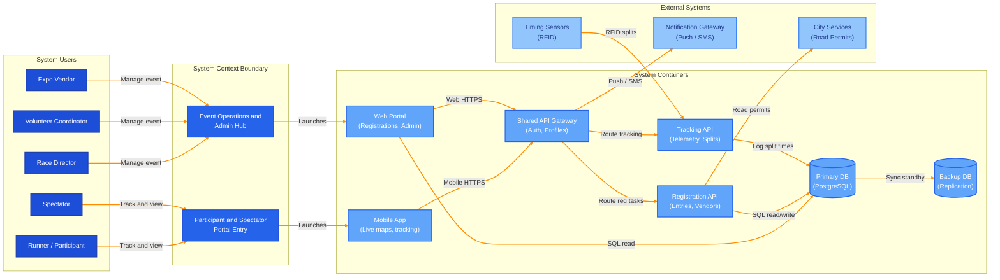

```mermaid
flowchart LR
    %% Styling Definitions
    classDef userStyle fill:#1D4ED8,stroke:#1E40AF,stroke-width:2px,color:#FFFFFF;
    classDef contextStyle fill:#2563EB,stroke:#1D4ED8,stroke-width:2px,color:#FFFFFF;
    classDef containerStyle fill:#60A5FA,stroke:#2563EB,stroke-width:2px,color:#FFFFFF;
    classDef extStyle fill:#93C5FD,stroke:#3B82F6,stroke-width:2px,color:#1E3A8A;

    subgraph USERS ["System Users"]
        U_Runner["Runner / Participant"]
        U_Spec["Spectator"]
        U_Dir["Race Director"]
        U_Vol["Volunteer Coordinator"]
        U_Ven["Expo Vendor"]
    end

    subgraph CONTEXT ["System Context Boundary"]
        CTX_Portal["Participant and Spectator<br/>Portal Entry"]
        CTX_Admin["Event Operations and<br/>Admin Hub"]
    end

    subgraph CONTAINERS ["System Containers"]
        C_App["Mobile App<br/>(Live maps, tracking)"]
        C_Web["Web Portal<br/>(Registrations, Admin)"]
        C_GW["Shared API Gateway<br/>(Auth, Profiles)"]
        C_RegAPI["Registration API<br/>(Entries, Vendors)"]
        C_TrackAPI["Tracking API<br/>(Telemetry, Splits)"]
        C_MainDB[("Primary DB<br/>(PostgreSQL)")]
        C_BackDB[("Backup DB<br/>(Replication)")]
    end

    subgraph EXTERNAL ["External Systems"]
        EXT_Sensors["Timing Sensors<br/>(RFID)"]
        EXT_City["City Services<br/>(Road Permits)"]
        EXT_Notif["Notification Gateway<br/>(Push / SMS)"]
    end

    %% Apply Component Styles
    class U_Runner,U_Spec,U_Dir,U_Vol,U_Ven userStyle;
    class CTX_Portal,CTX_Admin contextStyle;
    class C_App,C_Web,C_GW,C_RegAPI,C_TrackAPI,C_MainDB,C_BackDB containerStyle;
    class EXT_Sensors,EXT_City,EXT_Notif extStyle;

    %% Global Orange Link Styling
    linkStyle default stroke:#FF8C00,stroke-width:2px;

    %% User Interactions
    U_Runner -->|"Track and view"| CTX_Portal
    U_Spec -->|"Track and view"| CTX_Portal
    U_Dir -->|"Manage event"| CTX_Admin
    U_Vol -->|"Manage event"| CTX_Admin
    U_Ven -->|"Manage event"| CTX_Admin

    %% Boundary Ingress
    CTX_Portal -->|"Launches"| C_App
    CTX_Admin -->|"Launches"| C_Web

    %% Container Communications
    C_App -->|"Mobile HTTPS"| C_GW
    C_Web -->|"Web HTTPS"| C_GW
    C_Web -->|"SQL read"| C_MainDB

    C_GW -->|"Route reg tasks"| C_RegAPI
    C_GW -->|"Route tracking"| C_TrackAPI

    C_RegAPI -->|"SQL read/write"| C_MainDB
    C_TrackAPI -->|"Log split times"| C_MainDB
    C_MainDB -->|"Sync standby"| C_BackDB

    %% External System Integrations
    EXT_Sensors -->|"RFID splits"| C_TrackAPI
    C_RegAPI -->|"Road permits"| EXT_City
    C_GW -->|"Push / SMS"| EXT_Notif
```
