# Urban Marathon Event Management System

The following Mermaid diagram presents the principal users, platform capabilities, external services, and event outcomes described in the Urban Marathon Event case study.

```mermaid
flowchart TB
    subgraph USERS["Event Stakeholders"]
        direction LR
        RD["Race Director"]
        PA["Participant"]
        VC["Volunteer Coordinator"]
        SP["Spectator"]
        VE["Expo Vendor"]
    end

    subgraph PLATFORM["Urban Marathon Management Platform"]
        direction TB

        subgraph PRE["Planning and Preparation"]
            direction LR
            ROUTE["Route and Race Category<br/>Planning"]
            REG["Participant Registration<br/>and Entry Management"]
            SCHED["Race, Expo and Festivity<br/>Scheduling"]
            PACK["Race Pack and Timing Chip<br/>Distribution"]
        end

        subgraph OPERATIONS["Race-Day Operations"]
            direction LR
            START["Pace-Based Start<br/>Wave Management"]
            TRACK["Live Runner Tracking and<br/>Estimated Finish Times"]
            STATION["Hydration, Medical and<br/>Information Stations"]
            ALERT["Real-Time Schedule, Route<br/>and Weather Alerts"]
        end

        subgraph SUPPORT["People and Event Services"]
            direction LR
            VOL["Volunteer Assignments,<br/>Training and Updates"]
            EXPO["Vendor Registration,<br/>Booths and Expo Services"]
            VIEW["Routes, Checkpoints and<br/>Spectator Viewing Spots"]
        end

        subgraph POST["Post-Race Services"]
            direction LR
            RESULT["Timing, Results and<br/>Personal-Best Sharing"]
            FEEDBACK["Participant Feedback and<br/>Future Event Improvement"]
        end
    end

    subgraph EXTERNAL["External Coordination"]
        direction LR
        CITY["City Services<br/>Road Closures and Safety"]
        WEATHER["Weather and<br/>Condition Information"]
        TIMING["Timing Chips and<br/>Checkpoint Systems"]
        MOBILE["Web and Mobile<br/>Notification Channels"]
    end

    RD --> ROUTE
    RD --> SCHED
    RD --> START
    RD --> ALERT

    PA --> REG
    PA --> PACK
    PA --> TRACK
    PA --> RESULT
    PA --> FEEDBACK

    VC --> VOL
    VC --> STATION
    SP --> VIEW
    SP --> TRACK
    VE --> EXPO

    ROUTE <--> CITY
    STATION <--> CITY
    ALERT <--> WEATHER
    PACK <--> TIMING
    TRACK <--> TIMING
    ALERT --> MOBILE
    RESULT --> MOBILE

    REG --> PACK
    ROUTE --> SCHED
    SCHED --> START
    START --> TRACK
    TRACK --> RESULT
    RESULT --> FEEDBACK

    classDef stakeholder fill:#E8F1FF,stroke:#2563EB,stroke-width:2px,color:#102A56;
    classDef planning fill:#FFF4D6,stroke:#D97706,stroke-width:2px,color:#5B3400;
    classDef operation fill:#E5F8EE,stroke:#168A52,stroke-width:2px,color:#073D25;
    classDef support fill:#F2E9FF,stroke:#7C3AED,stroke-width:2px,color:#35136D;
    classDef postrace fill:#FFE8EF,stroke:#DB2777,stroke-width:2px,color:#67113A;
    classDef external fill:#EDF1F5,stroke:#52606D,stroke-width:2px,color:#1F2933;

    class RD,PA,VC,SP,VE stakeholder;
    class ROUTE,REG,SCHED,PACK planning;
    class START,TRACK,STATION,ALERT operation;
    class VOL,EXPO,VIEW support;
    class RESULT,FEEDBACK postrace;
    class CITY,WEATHER,TIMING,MOBILE external;

    style USERS fill:#F8FAFF,stroke:#93B4E8,stroke-width:2px
    style PLATFORM fill:#FFFFFF,stroke:#0F766E,stroke-width:3px
    style PRE fill:#FFFCF2,stroke:#E8B04B,stroke-width:1px
    style OPERATIONS fill:#F2FCF6,stroke:#65B98A,stroke-width:1px
    style SUPPORT fill:#FAF7FF,stroke:#A98ADE,stroke-width:1px
    style POST fill:#FFF5F8,stroke:#EC8EB3,stroke-width:1px
    style EXTERNAL fill:#F7F9FB,stroke:#9AA5B1,stroke-width:2px
```

## Colour Key

- Blue: event stakeholders
- Gold: planning and preparation
- Green: race-day operations
- Purple: people and event services
- Pink: post-race services
- Grey: external systems and city coordination
