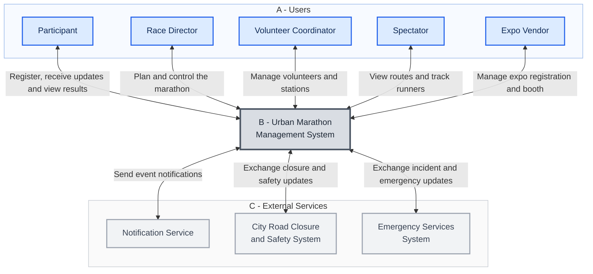
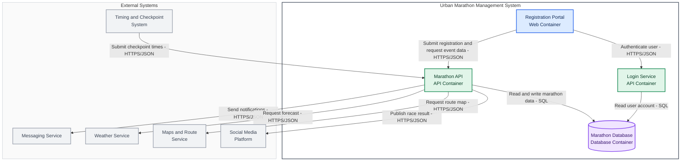
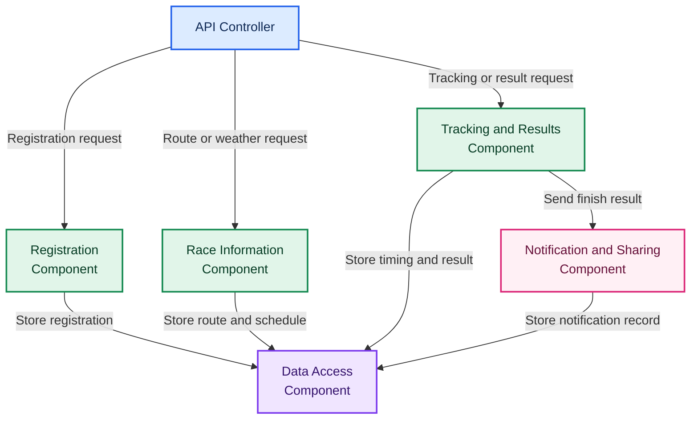
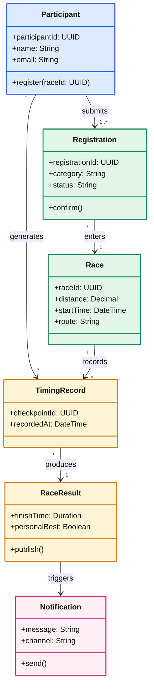

# Urban Marathon Event - C4 Model

## Graph 1 - Level 1: System Context

```mermaid
flowchart TB
    subgraph A["A - Users"]
        direction LR
        Participant["Participant"]
        Director["Race Director"]
        Coordinator["Volunteer Coordinator"]
        Spectator["Spectator"]
        Vendor["Expo Vendor"]
    end

    B["B - Urban Marathon<br/>Management System"]

    subgraph C["C - External Services"]
        direction LR
        Notification["Notification Service"]
        City["City Road Closure<br/>and Safety System"]
        Emergency["Emergency Services<br/>System"]
    end

    Participant <-->|"Register, receive updates and view results"| B
    Director <-->|"Plan and control the marathon"| B
    Coordinator <-->|"Manage volunteers and stations"| B
    Spectator <-->|"View routes and track runners"| B
    Vendor <-->|"Manage expo registration and booth"| B

    B <-->|"Send event notifications"| Notification
    B <-->|"Exchange closure and safety updates"| City
    B <-->|"Exchange incident and emergency updates"| Emergency

    classDef user fill:#DCEBFF,stroke:#2563EB,stroke-width:2px,color:#102A56;
    classDef system fill:#D9DDE3,stroke:#4B5563,stroke-width:3px,color:#1F2937;
    classDef external fill:#F1F3F5,stroke:#9CA3AF,stroke-width:2px,color:#374151;

    class Participant,Director,Coordinator,Spectator,Vendor user;
    class B system;
    class Notification,City,Emergency external;

    style A fill:#F7FAFF,stroke:#93B4E8,stroke-width:1px
    style C fill:#FAFAFA,stroke:#C4C9D0,stroke-width:1px
```

## Graph 2 - Level 2: Containers

```mermaid
flowchart TB
    subgraph SYSTEM["Urban Marathon Management System"]
        direction TB

        Registration["Registration Portal<br/>Web Container"]
        Login["Login Service<br/>API Container"]
        MarathonAPI["Marathon API<br/>API Container"]
        Database[("Marathon Database<br/>Database Container")]

        Registration -->|"Authenticate user - HTTPS/JSON"| Login
        Registration -->|"Submit registration and request event data - HTTPS/JSON"| MarathonAPI
        Login -->|"Read user account - SQL"| Database
        MarathonAPI -->|"Read and write marathon data - SQL"| Database
    end

    subgraph EXTERNAL["External Systems"]
        direction LR
        Messaging["Messaging Service"]
        Timing["Timing and Checkpoint<br/>System"]
        Weather["Weather Service"]
        Maps["Maps and Route<br/>Service"]
        Social["Social Media<br/>Platform"]
    end

    MarathonAPI -->|"Send notifications - HTTPS/JSON"| Messaging
    Timing -->|"Submit checkpoint times - HTTPS/JSON"| MarathonAPI
    MarathonAPI -->|"Request forecast - HTTPS/JSON"| Weather
    MarathonAPI -->|"Request route map - HTTPS/JSON"| Maps
    MarathonAPI -->|"Publish race result - HTTPS/JSON"| Social

    classDef client fill:#DCEBFF,stroke:#2563EB,stroke-width:2px,color:#102A56;
    classDef api fill:#E1F5E9,stroke:#168A52,stroke-width:2px,color:#073D25;
    classDef database fill:#F0E5FF,stroke:#7C3AED,stroke-width:2px,color:#35136D;
    classDef external fill:#F1F3F5,stroke:#9CA3AF,stroke-width:2px,color:#374151;

    class Registration client;
    class Login,MarathonAPI api;
    class Database database;
    class Messaging,Timing,Weather,Maps,Social external;

    style SYSTEM fill:#FFFFFF,stroke:#4B5563,stroke-width:2px
    style EXTERNAL fill:#FAFAFA,stroke:#C4C9D0,stroke-width:1px
```

## Graph 3 - Level 3: Marathon API Components

```mermaid
flowchart TB
    Controller["API Controller"]

    RegistrationComponent["Registration<br/>Component"]
    RaceComponent["Race Information<br/>Component"]
    TrackingComponent["Tracking and Results<br/>Component"]
    CommunicationComponent["Notification and Sharing<br/>Component"]
    DataAccess["Data Access<br/>Component"]

    Controller -->|"Registration request"| RegistrationComponent
    Controller -->|"Route or weather request"| RaceComponent
    Controller -->|"Tracking or result request"| TrackingComponent

    RegistrationComponent -->|"Store registration"| DataAccess
    RaceComponent -->|"Store route and schedule"| DataAccess
    TrackingComponent -->|"Store timing and result"| DataAccess
    TrackingComponent -->|"Send finish result"| CommunicationComponent
    CommunicationComponent -->|"Store notification record"| DataAccess

    classDef controller fill:#DCEBFF,stroke:#2563EB,stroke-width:2px,color:#102A56;
    classDef business fill:#E1F5E9,stroke:#168A52,stroke-width:2px,color:#073D25;
    classDef communication fill:#FFF0F5,stroke:#DB2777,stroke-width:2px,color:#67113A;
    classDef data fill:#F0E5FF,stroke:#7C3AED,stroke-width:2px,color:#35136D;

    class Controller controller;
    class RegistrationComponent,RaceComponent,TrackingComponent business;
    class CommunicationComponent communication;
    class DataAccess data;
```

## Graph 4 - Level 4: Class Diagram

```mermaid
classDiagram
    direction TB

    class Participant {
        +participantId: UUID
        +name: String
        +email: String
        +register(raceId: UUID)
    }

    class Registration {
        +registrationId: UUID
        +category: String
        +status: String
        +confirm()
    }

    class Race {
        +raceId: UUID
        +distance: Decimal
        +startTime: DateTime
        +route: String
    }

    class TimingRecord {
        +checkpointId: UUID
        +recordedAt: DateTime
    }

    class RaceResult {
        +finishTime: Duration
        +personalBest: Boolean
        +publish()
    }

    class Notification {
        +message: String
        +channel: String
        +send()
    }

    Participant "1" --> "1..*" Registration : submits
    Registration "*" --> "1" Race : enters
    Participant "1" --> "*" TimingRecord : generates
    Race "1" --> "*" TimingRecord : records
    TimingRecord "*" --> "1" RaceResult : produces
    RaceResult --> Notification : triggers

    style Participant fill:#DCEBFF,stroke:#2563EB,stroke-width:2px
    style Registration fill:#E1F5E9,stroke:#168A52,stroke-width:2px
    style Race fill:#E1F5E9,stroke:#168A52,stroke-width:2px
    style TimingRecord fill:#FFF4D6,stroke:#D97706,stroke-width:2px
    style RaceResult fill:#FFF4D6,stroke:#D97706,stroke-width:2px
    style Notification fill:#FFF0F5,stroke:#DB2777,stroke-width:2px
```
