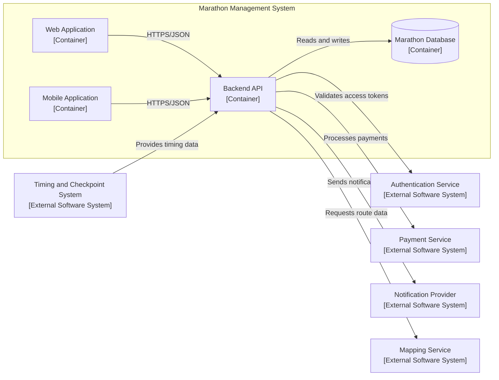
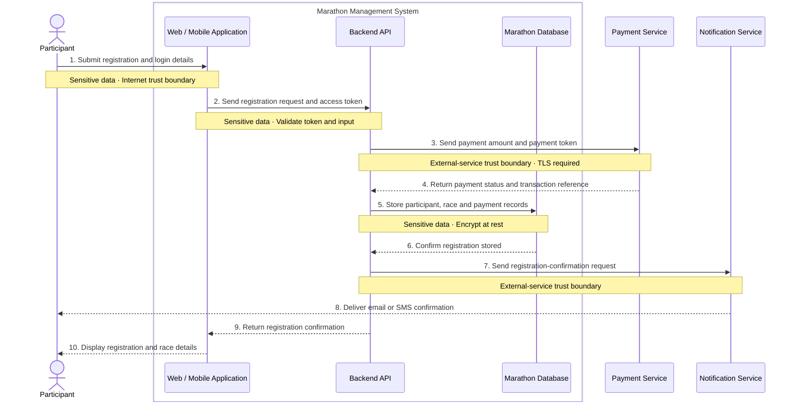
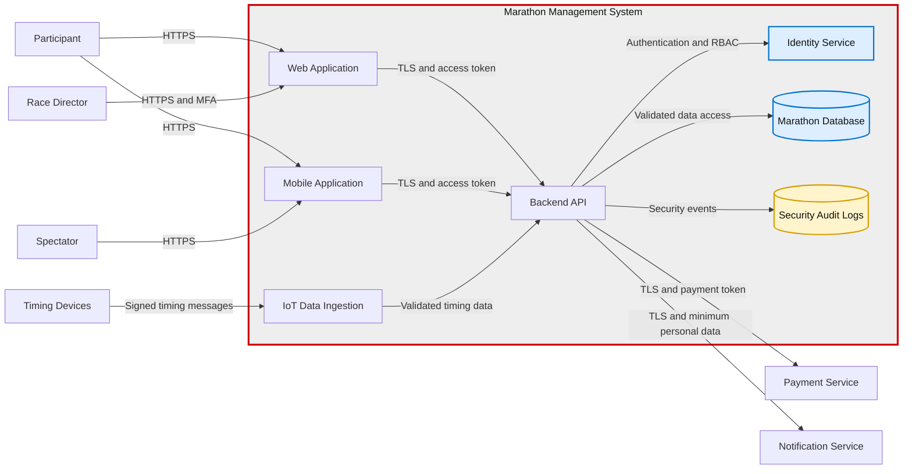
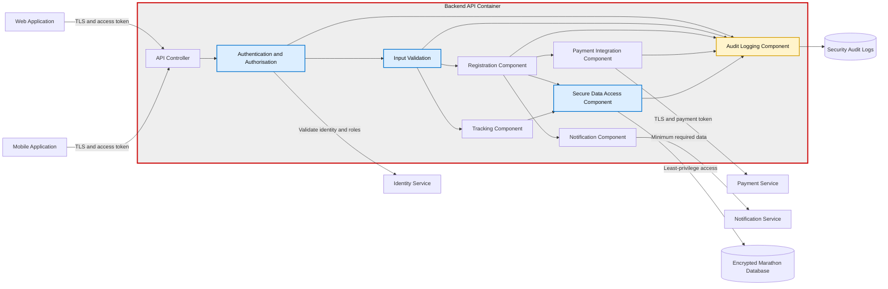
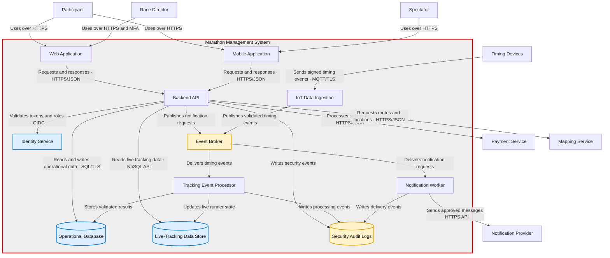
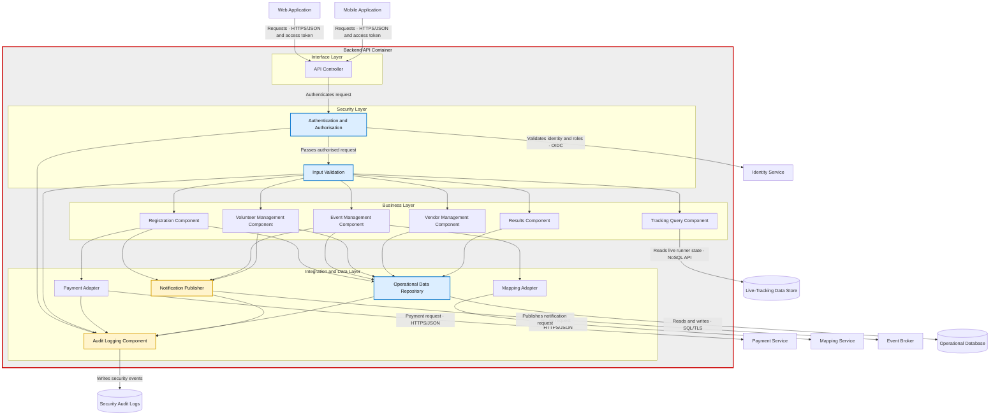

```mermaid
flowchart TB
    Participant[Participant]
    Spectator[Spectator]
    Director[Race Director]
    Devices[Timing Devices]

    subgraph MMS[Marathon Management System]
        Web[Web Application]
        Mobile[Mobile Application]
        API[Backend API]
        Identity[Identity Service]

        IoT[IoT Data Ingestion]
        Broker[Event Broker]
        DLQ[Dead-Letter Queue]
        TrackingProcessor[Tracking Event Processor]
        NotificationWorker[Notification Worker]
        Monitoring[Monitoring and Alerting]

        OperationalDB[(Operational Database)]
        TrackingDB[(Live-Tracking Data Store)]
        Logs[(Security Audit Logs)]
    end

    Payment[Payment Service]
    Notification[Notification Provider]
    Mapping[Mapping Service]

    Participant -->|Uses over HTTPS| Web
    Participant -->|Uses over HTTPS| Mobile
    Spectator -->|Uses over HTTPS| Mobile
    Director -->|Uses over HTTPS and MFA| Web

    Web -->|Requests and responses · HTTPS/JSON| API
    Mobile -->|Requests and responses · HTTPS/JSON| API

    API -->|Validates tokens and roles · OIDC| Identity
    API -->|Reads and writes operational data · SQL/TLS| OperationalDB
    API -->|Reads authorised tracking data · NoSQL API| TrackingDB
    API -->|Writes auditable security events| Logs

    API -->|Processes idempotent payments · HTTPS/JSON| Payment
    API -->|Requests routes with timeout and retry · HTTPS/JSON| Mapping
    API -->|Publishes notification requests| Broker

    Devices -->|Buffers and retransmits signed events · MQTT/TLS| IoT
    IoT -->|Validates device, fields and event ID| IoT
    IoT -->|Publishes valid timing events| Broker
    IoT -->|Routes invalid events| DLQ

    Broker -->|Delivers timing events| TrackingProcessor
    TrackingProcessor -->|Deduplicates and orders by time and sequence| TrackingProcessor
    TrackingProcessor -->|Updates live runner state| TrackingDB
    TrackingProcessor -->|Stores provisional results| OperationalDB
    TrackingProcessor -->|Routes failed events| DLQ
    TrackingProcessor -->|Writes processing events| Logs

    Director -->|Reviews and approves results| Web
    API -->|Publishes approved results| OperationalDB

    Broker -->|Delivers notification requests| NotificationWorker
    NotificationWorker -->|Sends with timeout and retry · HTTPS API| Notification
    NotificationWorker -->|Routes failed notifications| DLQ
    NotificationWorker -->|Writes delivery events| Logs

    Monitoring -->|Monitors queue depth and failures| Broker
    Monitoring -->|Monitors ingestion and event latency| IoT
    Monitoring -->|Monitors processing health| TrackingProcessor
    Monitoring -->|Monitors notification delivery| NotificationWorker
    Monitoring -->|Monitors unresolved failures| DLQ

    style MMS fill:#eeeeee,stroke:#cc0000,stroke-width:3px,color:#111111
    style Broker fill:#fff4cc,stroke:#d69e00,stroke-width:2px,color:#111111
    style DLQ fill:#ffe5e5,stroke:#cc0000,stroke-width:2px,color:#111111
    style Monitoring fill:#fff4cc,stroke:#d69e00,stroke-width:2px,color:#111111
    style OperationalDB fill:#dceeff,stroke:#0072ce,stroke-width:2px,color:#111111
    style TrackingDB fill:#dceeff,stroke:#0072ce,stroke-width:2px,color:#111111
    style Identity fill:#dceeff,stroke:#0072ce,stroke-width:2px,color:#111111
    style Logs fill:#fff4cc,stroke:#d69e00,stroke-width:2px,color:#111111
```

## C4 Context Analysis

###  C4 Level 1: System Context Analysis

| Reference # | Element Name | Element Type | Description | Interaction with Marathon Management System | Source/Justification |
|---|---|---|---|---|---|
| L1-001 | Race Director | Person | Plans and manages the marathon event | Manages race categories, routes, schedules and operational updates; monitors event activities and communicates changes | Race Director usage narrative |
| L1-002 | Participant | Person | Registers for and participates in the marathon | Registers, receives updates, views routes and start times, accesses tracking information and views results | Participant usage narrative |
| L1-003 | Volunteer Coordinator | Person | Organises and manages event volunteers | Assigns responsibilities, distributes training materials and communicates assignment changes | Volunteer Coordinator usage narrative |
| L1-004 | Spectator | Person | Follows and supports marathon participants | Views routes, identifies viewing locations and tracks selected runners | Spectator usage narrative |
| L1-005 | Vendor | Person | Participates in the marathon expo | Registers for the expo, selects a booth location and accesses authorised event information | Vendor usage narrative |
| L1-006 | City Services | External Organisation | Coordinates road closures, public safety and emergency support | Receives relevant route, schedule and operational information | Coordinate with city services business process |

### C4 Level 2: Container Analysis

| Reference # | Container Name | Container Type | Responsibility | Users Served | Communicates With | Data Used or Stored | NFR/Risk Justification |
|---|---|---|---|---|---|---|---|
| L2-001 | Web Application | Web Application | Provides browser-based access to marathon administration, registration, volunteer management, vendor services, race information and published results | Race Director, Participant, Volunteer Coordinator, Spectator and Vendor | Backend API | Displays registration, schedule, route, volunteer, vendor, tracking and results data received through the Backend API | Supports usability and broad network access; administrative functions require access control |
| L2-002 | Mobile Application | Mobile Application | Provides race-day access to schedules, routes, runner tracking, notifications and results | Participant and Spectator | Backend API, User Authentication and Notification Provider | Displays route, tracking, notification and results data received through authorised services | Supports mobility, timely updates and race-day availability; must remain responsive during peak demand |
| L2-003 | Backend API | Application/API | Implements marathon business rules and coordinates requests between applications, data stores and external systems | Web Application and Mobile Application users | Web Application, Mobile Application, Marathon Database and external systems | Processes registrations, schedules, volunteer assignments, vendor information, tracking events, notifications, feedback and results | Centralises business rules and access control; must support scalability, security, reliability and external-service failure handling |
| L2-004 | Marathon Database | Relational Data Store | Maintains the authoritative operational data for the marathon | Accessed indirectly through the Backend API | Backend API | Stores users, race categories, registrations, schedules, volunteer assignments, vendor details, timing records, official results and feedback | Supports data integrity, confidentiality, backup, recovery and controlled access |

### External Systems Analysis

| Reference # | External System Name | Responsibility | Connected Container | Data Sent to External System | Data Received from External System | Source/Justification |
|---|---|---|---|---|---|---|
| ES-001 | Payment Service | Processes registration and vendor payments | Backend API | Payment amount, transaction reference and payment token | Payment status and transaction confirmation | Architectural assumption supporting digital registration; verify against the backlog |
| ES-002 | Timing and Checkpoint System | Captures runner start, checkpoint and finish events | Backend API | Runner or timing-chip identifier and event configuration, where required | Checkpoint identifier, runner identifier, event time and finish time | Timing-chip distribution, real-time tracking and results business processes |
| ES-003 | Notification Provider | Delivers email, SMS and push notifications | Backend API | Recipient identifier, communication channel and notification content | Delivery status and failure information | Race Director, Participant and Volunteer Coordinator usage narratives |
| ES-004 | Mapping Service | Provides route and location information | Backend API | Route or location request | Route geometry, station locations, viewing locations and related map data | Participant and Spectator usage narratives |

---

## Cloud Selection Model

### Deployment Model

| Selected Deployment Model | Selection Justification | Key Risk | Risk Treatment |
|---|---|---|---|
| Public Cloud | Supports variable registration and race-day demand without requiring permanent infrastructure for peak capacity | Provider dependency and vendor lock-in | Use standard APIs, portable application containers, exportable data formats, tested backups and a documented recovery plan |

### C4 - L2 Cloud Deployment

| Internal C4 Element | Deployment Location | Selected Service Model | Selection Justification | AWS Service | Azure Service |
|---|---|---|---|---|---|
| Web Application | Public Cloud | PaaS | Managed hosting supports automated deployment, availability and event-demand scaling | AWS Amplify Hosting | Azure Static Web Apps |
| Mobile Application | User’s Mobile Device | Not Applicable | The application runs on the user’s device and accesses cloud services through the Backend API over HTTPS | N/A | N/A |
| Backend API | Public Cloud | PaaS | Managed application hosting reduces server administration and supports automatic scaling | AWS App Runner | Azure Container Apps |
| Marathon Database | Public Cloud | DBaaS | Managed relational storage provides backup, patching, monitoring and recovery | Amazon RDS for PostgreSQL | Azure Database for PostgreSQL |

### Cloud Capabilities & Services

| Cloud Capability | Selected Service Model | Selection Justification | AWS Service | Azure Service |
|---|---|---|---|---|
| User Authentication | Managed Identity Service | Provides user registration, login, authentication, authorisation and access-token management | Amazon Cognito | Microsoft Entra External ID |
| IoT Data Ingestion | IoT PaaS | Receives timing and checkpoint events from authorised race-day devices | AWS IoT Core | Azure IoT Hub |
| Streaming Data Ingestion | PaaS | Receives and streams high-volume race events for real-time processing | Amazon Kinesis Data Streams | Azure Event Hubs |
| Event Queue | PaaS | Buffers events and supports reliable asynchronous processing | Amazon SQS | Azure Service Bus |
| Serverless Event Processing | FaaS | Validates timing events, calculates race progress and identifies provisional winners | AWS Lambda | Azure Functions |
| Raw Race Data Storage | DSaaS | Stores raw timing events, imported files, logs and audit records | Amazon S3 | Azure Blob Storage |
| Live-Tracking Data Store | NoSQL DBaaS | Stores rapidly changing runner locations and checkpoint states | Amazon DynamoDB | Azure Cosmos DB |
| Operational Data Store | Relational DBaaS | Stores registrations, schedules, volunteers and official race results | Amazon RDS for PostgreSQL | Azure Database for PostgreSQL |
| Notification Delivery | Managed Communication Service | Delivers race updates, emergency alerts and approved result notifications | Amazon SNS and Amazon SES | Azure Communication Services and Azure Notification Hubs |
| Mapping and Location | Managed Location Service | Provides routes, station locations, viewing points and location information | Amazon Location Service | Azure Maps |

### External System Deployment Model

| External System | Selected Service Model | Responsibility | Connected Internal Element | AWS Integration | Azure Integration |
|---|---|---|---|---|---|
| Payment Service | SaaS | Processes registration and vendor payments | Backend API | Third-party payment provider connected through the Backend API | Third-party payment provider connected through the Backend API |
| Timing and Checkpoint Equipment | Specialist External System | Captures runner start, checkpoint and finish events | IoT Data Ingestion | AWS IoT Core | Azure IoT Hub |
| Mobile App Stores | External Distribution Platform | Distributes the Mobile Application to users’ devices | Mobile Application | Apple App Store and Google Play | Apple App Store and Google Play |

---

## Sample C4 Model using Mermaid

## Cloud Architecture

### Cloud Reference Architecture

---

## Security and Privacy

### Dynamic Diagram Analysis

| Interaction # | Source                 | Destination            | Data Flow                        | Sensitive Data                | Trust Boundary             |
| ------------- | ---------------------- | ---------------------- | -------------------------------- | ----------------------------- | -------------------------- |
| 1             | Participant            | Mobile/Web Application | Registration details             | Personal information          | Internet → Cloud           |
| 2             | Mobile/Web Application | Backend API            | Registration request and token   | Personal information, token   | Public → Application       |
| 3             | Backend API            | Payment Service        | Payment amount and payment token | Payment token                 | Organisation → Third party |
| 4             | Payment Service        | Backend API            | Payment confirmation             | Transaction reference         | Third party → Organisation |
| 5             | Backend API            | Marathon Database      | Participant registration         | Personal and race information | Application → Data         |
| 6             | Backend API            | Notification Service   | Confirmation message             | Name, email/phone             | Organisation → Third party |

### Dynamic Diagram

### STRIDE Threat Model

| Threat ID | Diagram Element/Data Flow | STRIDE Category        | Threat Description                                             | Security Impact             | Priority |
| --------- | ------------------------- | ---------------------- | -------------------------------------------------------------- | --------------------------- | -------- |
| T-01      | Participant login         | Spoofing               | An attacker uses stolen participant credentials                | Confidentiality             | High     |
| T-02      | Registration request      | Tampering              | Registration category or payment amount is modified            | Integrity                   | High     |
| T-03      | Registration transaction  | Repudiation            | A participant disputes submitting an entry or payment          | Accountability              | Medium   |
| T-04      | Marathon Database         | Information Disclosure | Participant contact, medical or tracking data is exposed       | Confidentiality and privacy | High     |
| T-05      | Tracking API              | Denial of Service      | Heavy or malicious traffic prevents live race tracking         | Availability                | High     |
| T-06      | Volunteer account         | Elevation of Privilege | A volunteer gains race-director permissions                    | Authorization               | High     |
| T-07      | Vendor access             | Information Disclosure | Vendors access participant information beyond legitimate needs | Privacy                     | High     |
| T-08      | Timing devices            | Tampering              | False checkpoint or finish-time data is submitted              | Integrity                   | High     |

### Security Mitigation Analysis

| Threat ID | Mitigation Technique                | Security Control                                  | Responsible Element   | Residual Risk |
| --------- | ----------------------------------- | ------------------------------------------------- | --------------------- | ------------- |
| T-01      | Strong authentication               | MFA, secure sessions and login monitoring         | Identity Service      | Medium        |
| T-02      | Validate trusted values server-side | Input validation, TLS and integrity checks        | Backend API           | Low           |
| T-03      | Maintain auditable records          | Tamper-resistant transaction logs                 | Backend API           | Low           |
| T-04      | Protect sensitive data              | Encryption, least privilege and data minimisation | Marathon Database     | Medium        |
| T-05      | Protect service availability        | Rate limiting, autoscaling and DDoS protection    | API Gateway           | Medium        |
| T-06      | Enforce role boundaries             | Role-based access control                         | Identity Service      | Low           |
| T-07      | Restrict vendor information         | Aggregated data and consent controls              | Vendor Portal         | Low           |
| T-08      | Authenticate timing devices         | Device identity, signed messages and validation   | IoT Ingestion Service | Medium        |

### C4 Level 2 — Secure Container Diagram

### C4 Level 3 — Secure Backend API Component Diagram

### Architecture Smell Analysis — Sample Solution

| Reference # | C4 Element(s)                                                              | Architecture Smell      | Evidence                                                                                                                       | Proposed Correction                                                                                                                                         |
| ----------- | -------------------------------------------------------------------------- | ----------------------- | ------------------------------------------------------------------------------------------------------------------------------ | ----------------------------------------------------------------------------------------------------------------------------------------------------------- |
| AS-001      | Backend API                                                                | Feature Concentration   | Processes registrations, schedules, volunteers, vendors, tracking, notifications, feedback, results, and external integrations | Separate responsibilities into focused components or services for registration, event management, tracking, results, volunteers, vendors, and notifications |
| AS-002      | Web Application, Mobile Application, Backend API and Notification Provider | Scattered Functionality | Notification responsibilities and connections are distributed across several elements                                          | Centralise notification rules in a Notification Component; clients only receive and display notifications                                                   |
| AS-003      | Backend API                                                                | Dense Structure         | Directly communicates with applications, the database, authentication, payment, timing, notification, and mapping systems      | Introduce focused integration components and asynchronous messaging for timing and notification processing                                                  |
| AS-004      | Marathon Database                                                          | Feature Concentration   | Stores registrations, schedules, volunteers, vendors, timing records, results, and feedback in one data store                  | Separate operational data from high-volume tracking data and raw timing events                                                                              |
| AS-005      | Backend API and external services                                          | Unstable Dependency     | Core marathon functions depend directly on Payment, Notification, Mapping, and Timing services                                 | Access external services through adapters; apply queues, retries, timeouts, and failure handling                                                            |
| AS-006      | Timing processing and Backend API                                          | Scattered Functionality | The Backend API processes tracking events while timing devices and ingestion services also handle timing responsibilities      | Route timing events through IoT ingestion, an event stream, and dedicated tracking processing                                                               |
| AS-007      | Current C4 relationships                                                   | Cyclic Dependency       | No relationship currently shows two elements depending directly or indirectly on each other                                    | No correction required; recheck after updating the architecture                                                                                             |

### Architecture Pattern Analysis — Sample Solution

| Architecture Style | Requirements Supported                                                                              | Advantages                                                                                            | Disadvantages                                                                | Decision                                                       |
| ------------------ | --------------------------------------------------------------------------------------------------- | ----------------------------------------------------------------------------------------------------- | ---------------------------------------------------------------------------- | -------------------------------------------------------------- |
| Layered            | Registration, event administration, volunteer management, vendor management, and results publishing | Clear separation of presentation, business, and data responsibilities; easier testing and maintenance | Limited deployment independence; tightly coupled layers may restrict scaling | Use within the Web Application and Backend API                 |
| Service-Oriented   | Payment, mapping, notification, authentication, and city-service integration                        | Reusable services and standard interfaces support external integration                                | Service coordination and governance add complexity                           | Use for integration with shared and external services          |
| Event-Driven       | Timing events, live tracking, race updates, alerts, and result processing                           | Supports asynchronous processing, traffic spikes, resilience, and real-time updates                   | More difficult tracing, testing, ordering, and error handling                | Use for race-day timing, tracking, and notifications           |
| Microservices      | Registration, tracking, results, volunteer, vendor, and notification capabilities                   | Independent deployment and scaling; isolates failures and responsibilities                            | Increases deployment, monitoring, networking, and data-management complexity | Use selectively for capabilities requiring independent scaling |

> Selected Approach: A hybrid architecture combining layered organisation, service-based integration, event-driven race processing, and selectively deployed microservices.

### Communication and Dependency Analysis — Sample Solution

| Source                       | Destination                 | Data Exchanged                                                        | Response  | Dependency Holder            | Pattern and Protocol                              | Justification                                            |
| ---------------------------- | --------------------------- | --------------------------------------------------------------------- | --------- | ---------------------------- | ------------------------------------------------- | -------------------------------------------------------- |
| Web Application              | Backend API                 | Registration, administration, volunteer, vendor, and results requests | Immediate | Web Application              | API — HTTPS/JSON                                  | Browser operations require an immediate result           |
| Mobile Application           | Backend API                 | Schedules, routes, tracking, and results requests                     | Immediate | Mobile Application           | API — HTTPS/JSON                                  | Mobile users require current race information            |
| Web/Mobile Application       | Identity Service            | Login details and authentication tokens                               | Immediate | Web/Mobile Application       | API — OAuth 2.0/OpenID Connect over HTTPS         | Provides centralised authentication and token management |
| Backend API                  | Marathon Database           | Registrations, schedules, volunteers, vendors, feedback, and results  | Immediate | Backend API                  | Repository — PostgreSQL connection                | Maintains authoritative operational data                 |
| Backend API                  | Payment Service             | Payment token, amount, and transaction reference                      | Immediate | Backend API                  | API — HTTPS/JSON                                  | Registration requires payment confirmation               |
| Backend API                  | Mapping Service             | Route, station, and viewing-location requests                         | Immediate | Backend API                  | API — HTTPS/JSON                                  | Applications require current map and route information   |
| Timing and Checkpoint System | IoT Data Ingestion          | Runner identifier, checkpoint, and event time                         | Delayed   | Timing and Checkpoint System | Broker — MQTT over TLS                            | Supports secure, high-volume device communication        |
| IoT Data Ingestion           | Event Stream                | Validated timing events                                               | Delayed   | IoT Data Ingestion           | Queue/Broker — event stream                       | Decouples timing devices from event processing           |
| Event Stream                 | Serverless Event Processing | Timing and checkpoint events                                          | Delayed   | Serverless Event Processing  | Queue/Broker — asynchronous event consumption     | Supports scalable and resilient race-day processing      |
| Serverless Event Processing  | Live-Tracking Data Store    | Runner location, pace, and checkpoint state                           | Delayed   | Serverless Event Processing  | Repository — NoSQL API                            | Supports frequent updates and low-latency tracking       |
| Serverless Event Processing  | Operational Data Store      | Validated finish times and official results                           | Delayed   | Serverless Event Processing  | Repository — PostgreSQL connection                | Preserves validated authoritative results                |
| Backend API                  | Notification Service        | Recipient, channel, and notification content                          | Delayed   | Backend API                  | Queue/Broker — asynchronous message               | Notification delivery should not block user requests     |
| Notification Service         | Mobile Application          | Race updates and emergency alerts                                     | Delayed   | Mobile Application           | Persistent Connection — push-notification channel | Delivers timely race-day updates to mobile users         |

### Updated C4 Level 2 — Container Diagram

### Updated C4 Level 3 — Backend API Component Diagram

### C4 Level 2 Architecture Evaluation — Sample Solution

| Requirement                 | Architectural Support                                                                         | Rating (0–5) | Evidence                                                                                                                 | Improvement                                                                |
| --------------------------- | --------------------------------------------------------------------------------------------- | -----------: | ------------------------------------------------------------------------------------------------------------------------ | -------------------------------------------------------------------------- |
| Participant registration    | Web Application, Mobile Application, Backend API, Operational Database and Payment Service    |            5 | Applications send registration requests to the Backend API, which coordinates payment and stores confirmed registrations | Add idempotency controls to prevent duplicate registrations and payments   |
| Event administration        | Web Application, Backend API and Operational Database                                         |            5 | Race directors can manage routes, categories, schedules, volunteers and vendors through central business components      | Add an audit log for administrative changes                                |
| Live runner tracking        | Timing Devices, IoT Data Ingestion, Event Stream, Tracking Processing and Tracking Data Store |            5 | Signed timing events are ingested, queued and processed asynchronously                                                   | Define handling for missing, duplicated and out-of-order events            |
| Results publishing          | Results Component, Operational Database, Web Application and Mobile Application               |            4 | Validated timing data supports result calculation and publication through the applications                               | Add a result-verification and approval step before publication             |
| Timely notifications        | Notification Component, Event Stream and Notification Provider                                |            4 | Notifications are processed asynchronously without blocking user requests                                                | Add retry, dead-letter queue and delivery-status monitoring                |
| Performance and scalability | IoT Data Ingestion, Event Stream and dedicated event processing                               |            5 | High-volume race-day events are buffered and processed independently of the Backend API                                  | Define capacity targets and load-testing thresholds                        |
| Availability                | Event Stream, separate processing services and managed cloud services                         |            4 | Queuing allows timing events to remain available when downstream processing is temporarily unavailable                   | Add failover, health monitoring and recovery procedures                    |
| Security and privacy        | Authentication, access control, TLS, signed timing messages and protected data stores         |            4 | External requests and device events are authenticated and sensitive data is protected                                    | Document consent, retention and access rules for participant tracking data |
| Data integrity              | Validated timing events, Operational Database and Tracking Data Store                         |            4 | Timing data is validated before processing and operational records are stored separately                                 | Add duplicate detection, sequence validation and reconciliation controls   |
| Maintainability             | Focused Backend API components, external-service adapters and separated data stores           |            4 | Responsibilities are separated and external integrations are isolated from core business logic                           | Define interface contracts and ownership boundaries for each component     |

### Architectural Alternatives Evaluation — Sample Solution

| Scenario                                                  | Alternatives                                                                                                                                         | Benefits                                                                                                                                     | Trade-offs                                                                                                                                    | Decision                 | Justification                                                                                      |
| --------------------------------------------------------- | ---------------------------------------------------------------------------------------------------------------------------------------------------- | -------------------------------------------------------------------------------------------------------------------------------------------- | --------------------------------------------------------------------------------------------------------------------------------------------- | ------------------------ | -------------------------------------------------------------------------------------------------- |
| A large burst of timing events occurs at a checkpoint     | **A:** Send events directly to the Backend API. **B:** Send events through IoT Data Ingestion and the Event Stream.                               | **A:** Simple architecture; immediate processing. **B:** Buffers traffic; supports independent scaling and reliable processing.           | **A:** Backend API may become overloaded; events may be lost. **B:** Adds infrastructure, monitoring and event-ordering complexity.        | Select **Alternative B** | The Event Stream protects the Backend API and supports scalable race-day event processing.         |
| The Notification Provider becomes temporarily unavailable | **A:** Call the provider synchronously from the Backend API. **B:** Place notifications in a queue for asynchronous delivery.                     | **A:** Immediate delivery result; simple request flow. **B:** Supports retries and prevents provider failure from blocking user requests. | **A:** Slow or failed provider calls affect application availability. **B:** Notifications may be delayed and require queue monitoring.    | Select **Alternative B** | Asynchronous delivery improves resilience and isolates the application from provider failures.     |
| Live-tracking data grows significantly during race day    | **A:** Store tracking and operational data in the Operational Database. **B:** Store high-volume tracking data in a separate Tracking Data Store. | **A:** Simpler data management and fewer services. **B:** Independent scaling; protects registration and administration workloads.        | **A:** Tracking traffic may reduce operational database performance. **B:** Adds data consistency, integration and operational complexity. | Select **Alternative B** | Separating tracking data supports higher event volumes without affecting core marathon operations. |

### HAZOP Analysis — Sample Solution

| Interaction                         | Guide Word       | Deviation                                                         | Cause                                                           | Consequence                                                        | Risk Priority | Mitigation                                                                                 | Responsible Element                  |
| ----------------------------------- | ---------------- | ----------------------------------------------------------------- | --------------------------------------------------------------- | ------------------------------------------------------------------ | ------------- | ------------------------------------------------------------------------------------------ | ------------------------------------ |
| Timing Devices → IoT Data Ingestion | **No**           | No timing event is received                                       | Device failure, network outage or depleted battery              | Runner location and finish time cannot be recorded                 | High          | Monitor device connectivity, buffer events locally and retransmit after reconnection       | Timing Device and IoT Data Ingestion |
| Timing Devices → IoT Data Ingestion | **More**         | Duplicate timing events are received                              | Device retry or repeated message delivery                       | Duplicate checkpoint records and incorrect race results            | High          | Assign a unique event ID and reject previously processed events                            | IoT Data Ingestion                   |
| Timing Devices → IoT Data Ingestion | **Part of**      | Runner identifier, checkpoint identifier or event time is missing | Faulty sensor data or incomplete message construction           | Event cannot be matched to the correct runner or checkpoint        | High          | Validate the required message fields and route invalid events for review                   | IoT Data Ingestion                   |
| Timing Devices → IoT Data Ingestion | **Other than**   | The event contains an incorrect runner or checkpoint identifier   | Device misconfiguration, tampering or incorrect chip assignment | Tracking information and results are assigned incorrectly          | High          | Authenticate devices, validate identifiers and reconcile events against race configuration | IoT Data Ingestion                   |
| IoT Data Ingestion → Event Stream   | **Late**         | A valid event is published after a significant delay              | Network congestion, ingestion overload or repeated retries      | Live tracking becomes inaccurate and results processing is delayed | Medium        | Monitor event latency, scale ingestion capacity and prioritise timing events               | IoT Data Ingestion and Event Stream  |
| Event Stream → Event Processing     | **Before/After** | Checkpoint events are processed in the wrong sequence             | Asynchronous delivery or parallel event processing              | Incorrect runner progress, pace estimates or finish results        | High          | Apply timestamps and sequence numbers; reorder or hold events before updating results      | Event Processing                     |

### HAZOP Analysis — Sample Solution

| Interaction                         | Guide Word       | Deviation                                                         | Cause                                                           | Consequence                                                        | Risk Priority | Mitigation                                                                                 | Responsible Element                  |
| ----------------------------------- | ---------------- | ----------------------------------------------------------------- | --------------------------------------------------------------- | ------------------------------------------------------------------ | ------------- | ------------------------------------------------------------------------------------------ | ------------------------------------ |
| Timing Devices → IoT Data Ingestion | **No**           | No timing event is received                                       | Device failure, network outage or depleted battery              | Runner location and finish time cannot be recorded                 | High          | Monitor device connectivity, buffer events locally and retransmit after reconnection       | Timing Device and IoT Data Ingestion |
| Timing Devices → IoT Data Ingestion | **More**         | Duplicate timing events are received                              | Device retry or repeated message delivery                       | Duplicate checkpoint records and incorrect race results            | High          | Assign a unique event ID and reject previously processed events                            | IoT Data Ingestion                   |
| Timing Devices → IoT Data Ingestion | **Part of**      | Runner identifier, checkpoint identifier or event time is missing | Faulty sensor data or incomplete message construction           | Event cannot be matched to the correct runner or checkpoint        | High          | Validate the required message fields and route invalid events for review                   | IoT Data Ingestion                   |
| Timing Devices → IoT Data Ingestion | **Other than**   | The event contains an incorrect runner or checkpoint identifier   | Device misconfiguration, tampering or incorrect chip assignment | Tracking information and results are assigned incorrectly          | High          | Authenticate devices, validate identifiers and reconcile events against race configuration | IoT Data Ingestion                   |
| IoT Data Ingestion → Event Stream   | **Late**         | A valid event is published after a significant delay              | Network congestion, ingestion overload or repeated retries      | Live tracking becomes inaccurate and results processing is delayed | Medium        | Monitor event latency, scale ingestion capacity and prioritise timing events               | IoT Data Ingestion and Event Stream  |
| Event Stream → Event Processing     | **Before/After** | Checkpoint events are processed in the wrong sequence             | Asynchronous delivery or parallel event processing              | Incorrect runner progress, pace estimates or finish results        | High          | Apply timestamps and sequence numbers; reorder or hold events before updating results      | Event Processing                     |

### Architectural Decision and Documentation — Sample Solution

| Issue                                                               | Alternatives                                                                                | Decision                                            | Rationale                                                                                     | Affected C4 Elements                                                         | Stakeholders                            |
| ------------------------------------------------------------------- | ------------------------------------------------------------------------------------------- | --------------------------------------------------- | --------------------------------------------------------------------------------------------- | ---------------------------------------------------------------------------- | --------------------------------------- |
| Checkpoint event bursts may overload the Backend API                | Process events directly through the Backend API; use IoT Data Ingestion and an Event Stream | Use IoT Data Ingestion and the Event Stream         | Buffers race-day traffic, prevents Backend API overload and supports independent scaling      | Timing Devices, IoT Data Ingestion, Event Stream, Event Processing           | Developers, Maintainers, Race Director  |
| Notification Provider failure may block user requests               | Synchronous provider calls; asynchronous queued delivery                                    | Use asynchronous queued delivery                    | Isolates the Backend API from provider failures and supports retries                          | Backend API, Notification Component, Event Stream, Notification Provider     | Developers, Maintainers, Participants   |
| High-volume tracking data may affect operational functions          | Use the Operational Database; use a separate Tracking Data Store                            | Use a separate Tracking Data Store                  | Allows tracking data to scale independently without affecting registration and administration | Event Processing, Tracking Data Store, Operational Database                  | Developers, Maintainers, Race Director  |
| Duplicate or incomplete timing events may produce incorrect results | Process all received events; validate and deduplicate events before processing              | Validate and deduplicate timing events              | Protects tracking and result integrity by rejecting invalid or repeated events                | IoT Data Ingestion, Event Processing                                         | Developers, Maintainers, Participants   |
| Timing events may arrive in the wrong sequence                      | Process events in arrival order; reorder events using timestamps and sequence numbers       | Reorder events before updating tracking and results | Prevents incorrect runner progress, pace estimates and race results                           | Event Stream, Event Processing, Results Component                            | Developers, Race Director, Participants |
| Results may be published before verification                        | Publish automatically; require verification and approval                                    | Require verification before publication             | Reduces the risk of publishing inaccurate official results                                    | Results Component, Operational Database, Web Application, Mobile Application | Race Director, Participants, Spectators |

### Updated C4 Level 2 — Container Diagram

