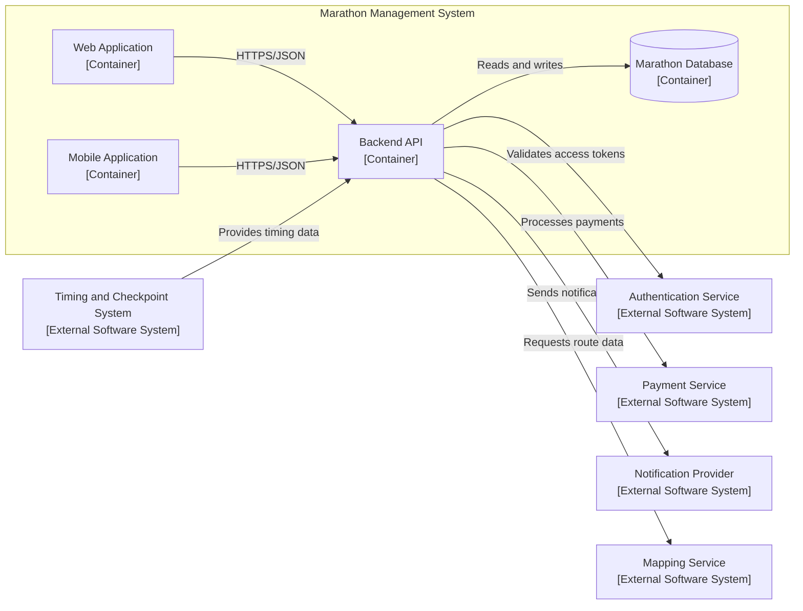
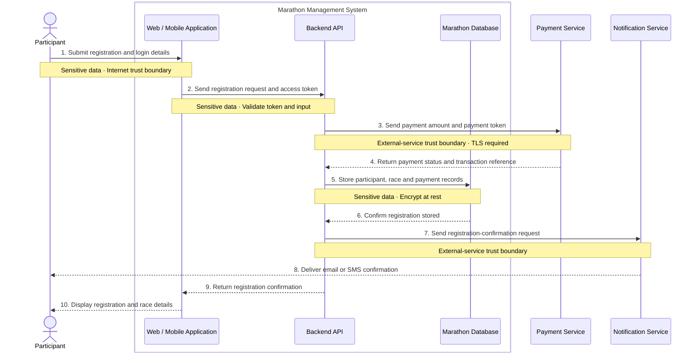
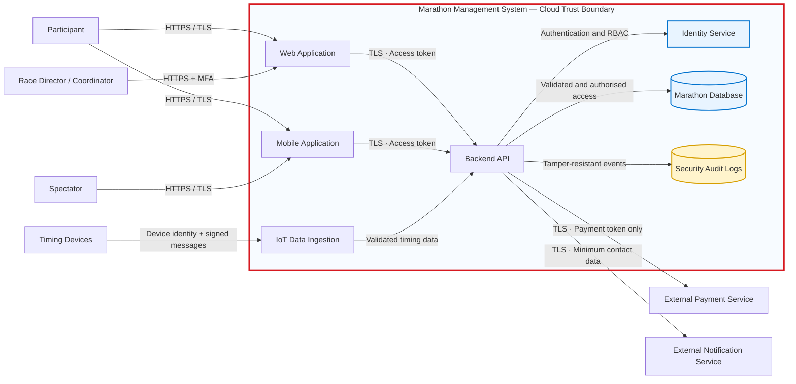
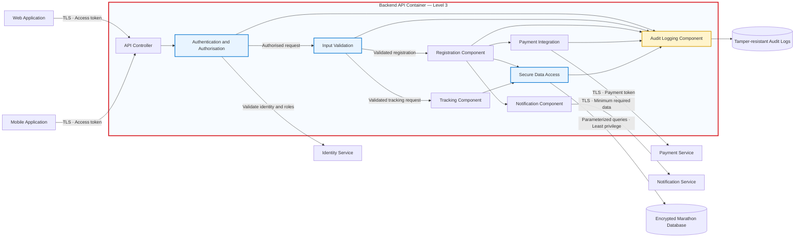

## C4 Context Analysis

###  C4 Level 1: System Context Analysis

| Reference # | Element Name | Element Type | Description | Interaction with Marathon Management System | Source/Justification |
|---|---|---|---|---|---|
| L1-001 | Race Director | Person | Plans and manages the marathon event | Manages race categories, routes, schedules and operational updates; monitors event activities and communicates changes | Race Director usage narrative |
| L1-002 | Participant | Person | Registers for and participates in the marathon | Registers, receives updates, views routes and start times, accesses tracking information and views results | Participant usage narrative |
| L1-003 | Volunteer Coordinator | Person | Organises and manages event volunteers | Assigns responsibilities, distributes training materials and communicates assignment changes | Volunteer Coordinator usage narrative |
| L1-004 | Spectator | Person | Follows and supports marathon participants | Views routes, identifies viewing locations and tracks selected runners | Spectator usage narrative |
| L1-005 | Vendor | Person | Participates in the marathon expo | Registers for the expo, selects a booth location and accesses authorised event information | Vendor usage narrative |
| L1-006 | City Services | External Organisation | Coordinates road closures, public safety and emergency support | Receives relevant route, schedule and operational information | Coordinate with city services business process |

### C4 Level 2: Container Analysis

| Reference # | Container Name | Container Type | Responsibility | Users Served | Communicates With | Data Used or Stored | NFR/Risk Justification |
|---|---|---|---|---|---|---|---|
| L2-001 | Web Application | Web Application | Provides browser-based access to marathon administration, registration, volunteer management, vendor services, race information and published results | Race Director, Participant, Volunteer Coordinator, Spectator and Vendor | Backend API | Displays registration, schedule, route, volunteer, vendor, tracking and results data received through the Backend API | Supports usability and broad network access; administrative functions require access control |
| L2-002 | Mobile Application | Mobile Application | Provides race-day access to schedules, routes, runner tracking, notifications and results | Participant and Spectator | Backend API, User Authentication and Notification Provider | Displays route, tracking, notification and results data received through authorised services | Supports mobility, timely updates and race-day availability; must remain responsive during peak demand |
| L2-003 | Backend API | Application/API | Implements marathon business rules and coordinates requests between applications, data stores and external systems | Web Application and Mobile Application users | Web Application, Mobile Application, Marathon Database and external systems | Processes registrations, schedules, volunteer assignments, vendor information, tracking events, notifications, feedback and results | Centralises business rules and access control; must support scalability, security, reliability and external-service failure handling |
| L2-004 | Marathon Database | Relational Data Store | Maintains the authoritative operational data for the marathon | Accessed indirectly through the Backend API | Backend API | Stores users, race categories, registrations, schedules, volunteer assignments, vendor details, timing records, official results and feedback | Supports data integrity, confidentiality, backup, recovery and controlled access |

### External Systems Analysis

| Reference # | External System Name | Responsibility | Connected Container | Data Sent to External System | Data Received from External System | Source/Justification |
|---|---|---|---|---|---|---|
| ES-001 | Payment Service | Processes registration and vendor payments | Backend API | Payment amount, transaction reference and payment token | Payment status and transaction confirmation | Architectural assumption supporting digital registration; verify against the backlog |
| ES-002 | Timing and Checkpoint System | Captures runner start, checkpoint and finish events | Backend API | Runner or timing-chip identifier and event configuration, where required | Checkpoint identifier, runner identifier, event time and finish time | Timing-chip distribution, real-time tracking and results business processes |
| ES-003 | Notification Provider | Delivers email, SMS and push notifications | Backend API | Recipient identifier, communication channel and notification content | Delivery status and failure information | Race Director, Participant and Volunteer Coordinator usage narratives |
| ES-004 | Mapping Service | Provides route and location information | Backend API | Route or location request | Route geometry, station locations, viewing locations and related map data | Participant and Spectator usage narratives |

---

## Cloud Selection Model

### Deployment Model

| Selected Deployment Model | Selection Justification | Key Risk | Risk Treatment |
|---|---|---|---|
| Public Cloud | Supports variable registration and race-day demand without requiring permanent infrastructure for peak capacity | Provider dependency and vendor lock-in | Use standard APIs, portable application containers, exportable data formats, tested backups and a documented recovery plan |

### C4 - L2 Cloud Deployment

| Internal C4 Element | Deployment Location | Selected Service Model | Selection Justification | AWS Service | Azure Service |
|---|---|---|---|---|---|
| Web Application | Public Cloud | PaaS | Managed hosting supports automated deployment, availability and event-demand scaling | AWS Amplify Hosting | Azure Static Web Apps |
| Mobile Application | User’s Mobile Device | Not Applicable | The application runs on the user’s device and accesses cloud services through the Backend API over HTTPS | N/A | N/A |
| Backend API | Public Cloud | PaaS | Managed application hosting reduces server administration and supports automatic scaling | AWS App Runner | Azure Container Apps |
| Marathon Database | Public Cloud | DBaaS | Managed relational storage provides backup, patching, monitoring and recovery | Amazon RDS for PostgreSQL | Azure Database for PostgreSQL |

### Cloud Capabilities & Services

| Cloud Capability | Selected Service Model | Selection Justification | AWS Service | Azure Service |
|---|---|---|---|---|
| User Authentication | Managed Identity Service | Provides user registration, login, authentication, authorisation and access-token management | Amazon Cognito | Microsoft Entra External ID |
| IoT Data Ingestion | IoT PaaS | Receives timing and checkpoint events from authorised race-day devices | AWS IoT Core | Azure IoT Hub |
| Streaming Data Ingestion | PaaS | Receives and streams high-volume race events for real-time processing | Amazon Kinesis Data Streams | Azure Event Hubs |
| Event Queue | PaaS | Buffers events and supports reliable asynchronous processing | Amazon SQS | Azure Service Bus |
| Serverless Event Processing | FaaS | Validates timing events, calculates race progress and identifies provisional winners | AWS Lambda | Azure Functions |
| Raw Race Data Storage | DSaaS | Stores raw timing events, imported files, logs and audit records | Amazon S3 | Azure Blob Storage |
| Live-Tracking Data Store | NoSQL DBaaS | Stores rapidly changing runner locations and checkpoint states | Amazon DynamoDB | Azure Cosmos DB |
| Operational Data Store | Relational DBaaS | Stores registrations, schedules, volunteers and official race results | Amazon RDS for PostgreSQL | Azure Database for PostgreSQL |
| Notification Delivery | Managed Communication Service | Delivers race updates, emergency alerts and approved result notifications | Amazon SNS and Amazon SES | Azure Communication Services and Azure Notification Hubs |
| Mapping and Location | Managed Location Service | Provides routes, station locations, viewing points and location information | Amazon Location Service | Azure Maps |

### External System Deployment Model

| External System | Selected Service Model | Responsibility | Connected Internal Element | AWS Integration | Azure Integration |
|---|---|---|---|---|---|
| Payment Service | SaaS | Processes registration and vendor payments | Backend API | Third-party payment provider connected through the Backend API | Third-party payment provider connected through the Backend API |
| Timing and Checkpoint Equipment | Specialist External System | Captures runner start, checkpoint and finish events | IoT Data Ingestion | AWS IoT Core | Azure IoT Hub |
| Mobile App Stores | External Distribution Platform | Distributes the Mobile Application to users’ devices | Mobile Application | Apple App Store and Google Play | Apple App Store and Google Play |

---

## Sample C4 Model using Mermaid

## Cloud Architecture

### Cloud Reference Architecture

---

## Security and Privacy

### Dynamic Diagram Analysis

| Interaction # | Source                 | Destination            | Data Flow                        | Sensitive Data                | Trust Boundary             |
| ------------- | ---------------------- | ---------------------- | -------------------------------- | ----------------------------- | -------------------------- |
| 1             | Participant            | Mobile/Web Application | Registration details             | Personal information          | Internet → Cloud           |
| 2             | Mobile/Web Application | Backend API            | Registration request and token   | Personal information, token   | Public → Application       |
| 3             | Backend API            | Payment Service        | Payment amount and payment token | Payment token                 | Organisation → Third party |
| 4             | Payment Service        | Backend API            | Payment confirmation             | Transaction reference         | Third party → Organisation |
| 5             | Backend API            | Marathon Database      | Participant registration         | Personal and race information | Application → Data         |
| 6             | Backend API            | Notification Service   | Confirmation message             | Name, email/phone             | Organisation → Third party |

### Dynamic Diagram

### STRIDE Threat Model

| Threat ID | Diagram Element/Data Flow | STRIDE Category        | Threat Description                                             | Security Impact             | Priority |
| --------- | ------------------------- | ---------------------- | -------------------------------------------------------------- | --------------------------- | -------- |
| T-01      | Participant login         | Spoofing               | An attacker uses stolen participant credentials                | Confidentiality             | High     |
| T-02      | Registration request      | Tampering              | Registration category or payment amount is modified            | Integrity                   | High     |
| T-03      | Registration transaction  | Repudiation            | A participant disputes submitting an entry or payment          | Accountability              | Medium   |
| T-04      | Marathon Database         | Information Disclosure | Participant contact, medical or tracking data is exposed       | Confidentiality and privacy | High     |
| T-05      | Tracking API              | Denial of Service      | Heavy or malicious traffic prevents live race tracking         | Availability                | High     |
| T-06      | Volunteer account         | Elevation of Privilege | A volunteer gains race-director permissions                    | Authorization               | High     |
| T-07      | Vendor access             | Information Disclosure | Vendors access participant information beyond legitimate needs | Privacy                     | High     |
| T-08      | Timing devices            | Tampering              | False checkpoint or finish-time data is submitted              | Integrity                   | High     |

### Security Mitigation Analysis

| Threat ID | Mitigation Technique                | Security Control                                  | Responsible Element   | Residual Risk |
| --------- | ----------------------------------- | ------------------------------------------------- | --------------------- | ------------- |
| T-01      | Strong authentication               | MFA, secure sessions and login monitoring         | Identity Service      | Medium        |
| T-02      | Validate trusted values server-side | Input validation, TLS and integrity checks        | Backend API           | Low           |
| T-03      | Maintain auditable records          | Tamper-resistant transaction logs                 | Backend API           | Low           |
| T-04      | Protect sensitive data              | Encryption, least privilege and data minimisation | Marathon Database     | Medium        |
| T-05      | Protect service availability        | Rate limiting, autoscaling and DDoS protection    | API Gateway           | Medium        |
| T-06      | Enforce role boundaries             | Role-based access control                         | Identity Service      | Low           |
| T-07      | Restrict vendor information         | Aggregated data and consent controls              | Vendor Portal         | Low           |
| T-08      | Authenticate timing devices         | Device identity, signed messages and validation   | IoT Ingestion Service | Medium        |

### C4 Level 2 — Secure Container Diagram

### C4 Level 3 — Secure Backend API Component Diagram

