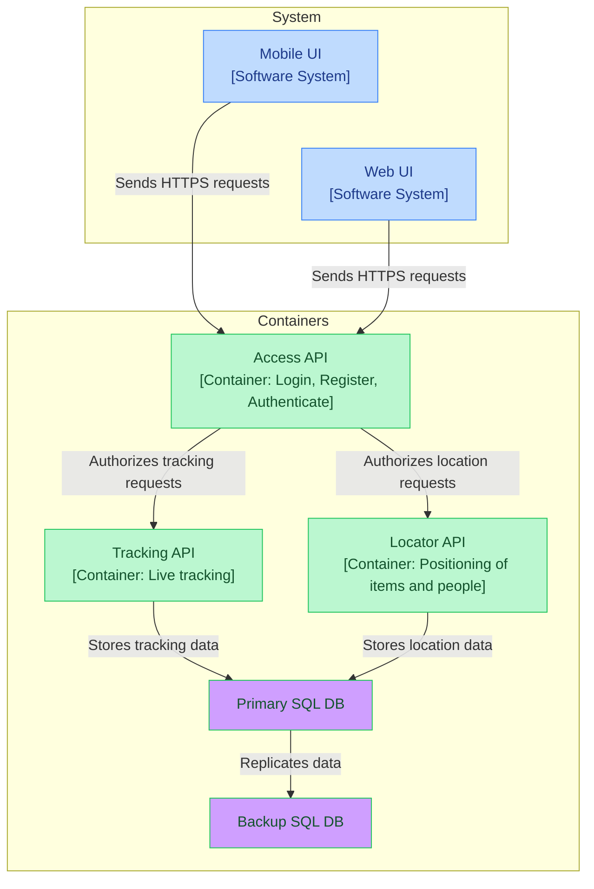

## Sample C4 Model using Mermaid

```mermaid
flowchart TD

subgraph L1["System"]
    direction LR

    Mobile["Mobile UI<br/>[Software System]"]
    Web["Web UI<br/>[Software System]"]

    Mobile ~~~ Web
end

subgraph L2["Containers"]
    direction TB

    ACCESS["Access API<br/>[Container: Login, Register, Authenticate]"]

    TRACKING["Tracking API<br/>[Container: Live tracking]"]
    LOCATION["Locator API<br/>[Container: Positioning of items and people]"]

    PRIMARY["Primary SQL DB"]
    BACKUP["Backup SQL DB"]

    ACCESS -->|"Authorizes tracking requests"| TRACKING
    ACCESS -->|"Authorizes location requests"| LOCATION

    TRACKING -->|"Stores tracking data"| PRIMARY
    LOCATION -->|"Stores location data"| PRIMARY

    PRIMARY -->|"Replicates data"| BACKUP
end

Mobile -->|"Sends HTTPS requests"| ACCESS
Web -->|"Sends HTTPS requests"| ACCESS
style Mobile fill:#BFDBFE,stroke:#3B82F6,color:#1E3A8A
style Web fill:#BFDBFE,stroke:#3B82F6,color:#1E3A8A
style ACCESS fill:#BBF7D0,stroke:#22C55E,color:#14532D
style TRACKING fill:#BBF7D0,stroke:#22C55E,color:#14532D
style LOCATION fill:#BBF7D0,stroke:#22C55E,color:#14532D
style PRIMARY fill:#CF9FFF,stroke:#22C55E,color:#14532D
style BACKUP fill:#CF9FFF,stroke:#22C55E,color:#14532D

```
